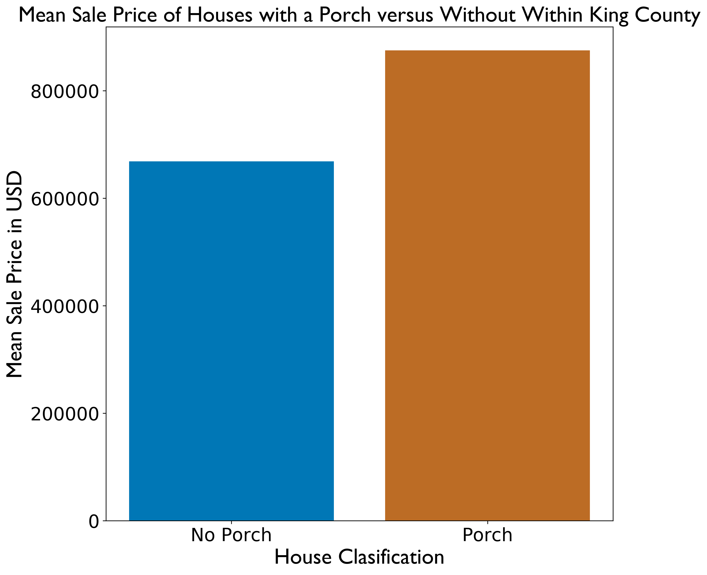

### THIS PROJECT IS CURRENTLY IN PROGRESS

# Table of Contents

<!--ts-->
 * [Files and Folders of Note](https://github.com/chum46/mod2_housing_sales#files-and-folders-of-note)
 * [General Setup Instructions](https://github.com/chum46/mod2_housing_sales#general-setup-instructions)
 * [Context of Project](https://github.com/chum46/mod2_housing_sales#context-of-project)
 * [Preview of Results](https://github.com/chum46/mod2_housing_sales#preview-of-results)
 * [Data](https://github.com/chum46/mod2_housing_sales#data)
 * [Process](https://github.com/chum46/mod2_housing_sales#process)
 * [Results](https://github.com/chum46/mod2_housing_sales#results)
 * [Strengths and Limitations]
 * [Real World Application](https://github.com/chum46/mod2_housing_sales#application)
 * [Next Steps](https://github.com/chum46/mod2_housing_sales#next-steps)
<!--te-->

# Files and Folders of Note
```
.
└── mod2_housing_sales
    ├── README.md
    ├── notebooks
    │   ├── exploratory
    │   │   ├── 00_mef_initial_data_cleaning.ipynb
    │   │   ├── 02_cm_download_and_explore_data.ipynb
    │   │   ├── 02_js_2experimenting\ models.ipynb
    │   │   ├── 02_js_Lookup\ info.ipynb
    │   │   ├── 02_js_Zero_explanation.ipynb
    │   │   ├── 02_js_experimenting\ models.ipynb
    │   │   ├── 02_js_exploratory_Visualizations.ipynb
    │   │   ├── 02_js_exploratory_question_2.ipynb
    │   │   ├── 02_js_exploratory_questions_1.ipynb
    │   │   └── 03_mef_noise_correlation.ipynb
    │   └── report
    │       └── 00_final_report_and_summary.ipynb
    ├── references
    │   └── README.md
    ├── reports
    │   ├── README.md
    │   └── figures
    └── src
        ├── cm_functions.py
        └── data_cleaning.py
```
#### Repo Navigation Links
 - [system requirements]
 - [presentation.pdf]
 - [final summary notebook](https://github.com/chum46/mod2_housing_sales/blob/master/notebooks/report/00_final_report_and_summary.ipynb)
 - [exploratory notebooks folder](https://github.com/chum46/mod2_housing_sales/tree/master/notebooks/exploratory)
 - [src folder](https://github.com/chum46/mod2_housing_sales/tree/master/src)
 - [references](https://github.com/chum46/mod2_housing_sales/tree/master/references)
 
# General Setup Instructions 

Ensure that you have installed [Anaconda](https://docs.anaconda.com/anaconda/install/) 

### `housing` conda Environment

This project relies on you using the [`environment.yml`](environment.yml) file to recreate the `housing` conda environment. To do so, please run the following commands *in your terminal*:
```bash
# create the housing conda environment
conda env create -f environment.yml
# activate the housing conda environment
conda activate housing
# if needed, make housing available to you as a kernel in jupyter
python -m ipykernel install --user --name housing --display-name "Python 3 (housing)"
```

# Context of Project

This project is aimed to help homeowners and potential homeowners in King County understand how specific features affect home sale prices in the area. The data we will use can be downloaded from here: https://info.kingcounty.gov/assessor/DataDownload/default.aspx. Through our analysis our end goal is to build a statistical model that is representative of the real world data.

The following questions are addressed:

1. Does higher square footage increase home sale price?
2. Does having a porch increases home sale price?
3. Does having a waterfront increase home sale prices?
4. Does the presence of a nuisance (power lines, traffic noise, airport noise) lower home sale prices?
5. Using this data, can a statistical model be built that accurately represents housing prices in King County?


# Preview of Results


### Figure 1. 
We can see there is about a 200,000 difference in home Sale Price when a home has a porch addition. Showing houses with a porch on average have a higher over all value.


# Data
Because the scope of this project is limited to only homes sold in King County, all of the data used in this project can be downloaded for free from the King County Assessors website. Here are the set up instructions so that you will have all the data required for the project's jupyter notebooks.

1. Download the following files place them in the repositories 'data' folder.
    - Real Property Sales: [Download](https://aqua.kingcounty.gov/extranet/assessor/Real%20Property%20Sales.zip)
     - Contains all sales info including sales price and sale reasons.
    - Residential Buildings: [Download](https://aqua.kingcounty.gov/extranet/assessor/Residential%20Building.zip)
     - Contains all building info including square footage, bathroom counts, etc.
    - Parcels: [Download](https://aqua.kingcounty.gov/extranet/assessor/Parcel.zip)
     - Contains information regarding the plots of land including waterfront access.
    - LookUp Codes: [Download](https://aqua.kingcounty.gov/extranet/assessor/Lookup.zip)
     - Contains the dictionary used for interpretting the values of the csv files. Use in conjunction with the data documents found in this projects references folder.
2. Once these files are in the data folder, extract them all in the projects data folder. 
    - As long as you have the four respective .csv files, you may now remove the original zip files or delete them.
3. For additional data sets, as well as all available documentation, visit this [link](https://info.kingcounty.gov/assessor/DataDownload/default.aspx) and accept the agreement to view all available data.


# Process
2. Does having a porch increases home sale price?
To address this business question we had to craft the neccesary dataframes that would shows us the values pertaining to residences with a porch. This was done by residential building dataframe and finding all value columns values that pertain to a porch and create a data frame that matched that criteria. The same ideology was used to make a dataframe that consisted of residences without a porch. After, both dataframes were made they were then joined on the "PIN" column found within all dataframes created in prior section. The means of the mean sale price of the porch and no-porch data frames were taken and then plotted against one another.
# Results
When looking at the correlation bewtween sale price and porch there seems to be a correlation between the two. Properties that have a porch on avergae sold for a higher price than those that did not. There also seemd to minute linear correaltion between the target variable(SalePruce) and the feature(porches).  

# Application

WIP

# Next Steps

When it comes to analyzing the the significance of the porch data we can delve deeper into making a stronger correlation. Also, when looking at the square footage of a closed versus open porch there may be some correlations to sale price. Given time I beleive this could yield fruitful results. 
