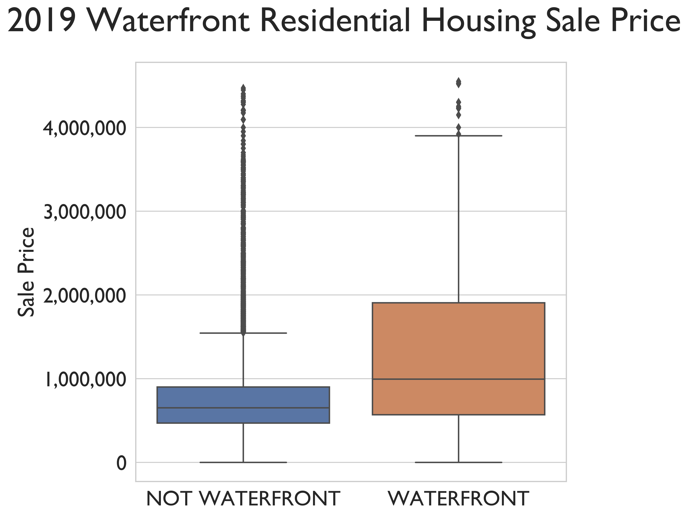

### THIS PROJECT IS CURRENTLY IN PROGRESS

# Table of Contents

<!--ts-->
 * [Files and Folders of Note](https://github.com/chum46/mod2_housing_sales#files-and-folders-of-note)
 * [General Setup Instructions](https://github.com/chum46/mod2_housing_sales#general-setup-instructions)
 * [Context of Project](https://github.com/chum46/mod2_housing_sales#context-of-project)
 * [Preview of Results](https://github.com/chum46/mod2_housing_sales#preview-of-results)
 * [Data](https://github.com/chum46/mod2_housing_sales#data)
 * [Process](https://github.com/chum46/mod2_housing_sales#process)
 * [Results](https://github.com/chum46/mod2_housing_sales#results)
 * [Strengths and Limitations]
 * [Real World Application](https://github.com/chum46/mod2_housing_sales#application)
 * [Next Steps](https://github.com/chum46/mod2_housing_sales#next-steps)
<!--te-->

# Files and Folders of Note
```
.
├── README.md
├── data
├── notebooks
│   ├── exploratory
│   │   ├── 00_mef_initial_data_cleaning.ipynb
│   │   ├── 01_cm_waterfront_analysis.ipynb
│   │   ├── 02_cm_download_and_explore_data.ipynb
│   │   ├── 02_js_2experimenting\ models.ipynb
│   │   ├── 02_js_Lookup\ info.ipynb
│   │   ├── 02_js_Zero_explanation.ipynb
│   │   ├── 02_js_experimenting\ models.ipynb
│   │   ├── 02_js_exploratory_Visualizations.ipynb
│   │   ├── 02_js_exploratory_question_2.ipynb
│   │   ├── 02_js_exploratory_questions_1.ipynb
│   │   ├── 03_mef_noise_correlation.ipynb
│   └── report
│       └── 00_final_report_and_summary.ipynb
├── references
├── reports
│   ├── Mod2_Presentation.pdf
│   └── figures
└── src
    ├── cm_functions.py
    └── data_cleaning.py
```
#### Repo Navigation Links
 - [presentation.pdf](https://github.com/chum46/mod2_housing_sales/blob/master/reports/Mod2_Presentation.pdf)
 - [final summary notebook](https://github.com/chum46/mod2_housing_sales/blob/master/notebooks/report/00_final_report_and_summary.ipynb)
 - [exploratory notebooks folder](https://github.com/chum46/mod2_housing_sales/tree/master/notebooks/exploratory)
 - [src folder](https://github.com/chum46/mod2_housing_sales/tree/master/src)
 - [references](https://github.com/chum46/mod2_housing_sales/tree/master/references)
 
# General Setup Instructions 

Ensure that you have installed [Anaconda](https://docs.anaconda.com/anaconda/install/) 

### `housing` conda Environment

This project relies on you using the [`environment.yml`](environment.yml) file to recreate the `housing` conda environment. To do so, please run the following commands *in your terminal*:
```bash
# create the housing conda environment
conda env create -f environment.yml
# activate the housing conda environment
conda activate housing
# if needed, make housing available to you as a kernel in jupyter
python -m ipykernel install --user --name housing --display-name "Python 3 (housing)"
```

# Context of Project

This project is aimed to help homeowners and potential homeowners in King County understand how specific features affect home sale prices in the area. The data we will use can be downloaded from [here](https://info.kingcounty.gov/assessor/DataDownload/default.aspx). Through our analysis our end goal is to build a statistical model that is representative of the real world data.

The following questions are addressed:

1. Does higher square footage increase home sale price?
2. Does having a porch increases home sale price?
3. Does having a waterfront increase home sale prices?
4. Does the presence of a nuisance (power lines, traffic noise, airport noise) lower home sale prices?
5. Using this data, can a statistical model be built that accurately represents housing prices in King County?


# Preview of Results

1. Does higher square footage increase home sale price?

##### Figure 1. 
Yes there is evidence of a linear, positive correlation between sqare footage and home sale price.
2. Does having a porch increases home sale price?

##### Figure 2. 
We can see there is about a 200,000 difference in home Sale Price when a home has a porch addition. Showing houses with a porch on average have a higher over all value.

3. Does having a waterfront increase home sale prices?

##### Figure 3. 
Since the median value is higher for waterfront property there is evidence that the industry claim is true.

4. Does the presence of a nuisance (power lines, traffic noise, airport noise) lower home sale prices?
We examined three main nuisances that were hypothesized to effect home value:

*Airport noise*
 - We found no entries in our data for homes that suffered from airport noise, so we could not examine this claim.

*Traffic noise*
 - We found very little difference between home sale values of homes with or without verying levels of traffic noise. 
 - We did find that homes with extreme traffic noise did have much lower sale value, but this was deemed statistically insignificant and could be due to the extremely small sample size. 
 - There did seem to be a sizeable group of low valued homes that suffered from traffic noise of all levels, which warrants further investigation.

*Power lines*
 - Despite a small sample size, we did find a statistically significant difference in mean sale values for homes with or without power line related nuisances. This shift was around $100,000.

*All nuisances*
 - We combined the extreme traffic noise subset witht he power line subset and found that this diminished the statistical significance of any difference.

5. Using this data, can a statistical model be built that accurately represents housing prices in King County?

##### Figure 4. 
Our statistical model was able to be constructed, meeting assumption checks. This qq plot shows evidence that our errors were independent of each other. 


# Data
Because the scope of this project is limited to only homes sold in King County, all of the data used in this project can be downloaded for free from the King County Assessors website. Here are the set up instructions so that you will have all the data required for the project's jupyter notebooks.

1. Download the following files place them in the repositories 'data' folder.
    - Real Property Sales: [Download](https://aqua.kingcounty.gov/extranet/assessor/Real%20Property%20Sales.zip)
     - Contains all sales info including sales price and sale reasons.
    - Residential Buildings: [Download](https://aqua.kingcounty.gov/extranet/assessor/Residential%20Building.zip)
     - Contains all building info including square footage, bathroom counts, etc.
    - Parcels: [Download](https://aqua.kingcounty.gov/extranet/assessor/Parcel.zip)
     - Contains information regarding the plots of land including waterfront access.
    - LookUp Codes: [Download](https://aqua.kingcounty.gov/extranet/assessor/Lookup.zip)
     - Contains the dictionary used for interpretting the values of the csv files. Use in conjunction with the data documents found in this projects references folder.
2. Once these files are in the data folder, extract them all in the projects data folder. 
    - As long as you have the four respective .csv files, you may now remove the original zip files or delete them.
3. For additional data sets, as well as all available documentation, visit this [link](https://info.kingcounty.gov/assessor/DataDownload/default.aspx) and accept the agreement to view all available data.


# Process
# 1. Clean and Filter Data

Using Pandas we created a series of filters through which we removed data that did not fit into the scope of this project. Here is a description of each filter we created:
- A. Property that was sold in 2019, to see the factors that affect the current market.

- B. Property that was sold, as opposed to foreclosed or transferred as part of a settlement.

- C. Property that is residential, as opposed to commercial.

- D. Property that was not 'sold' for a value of zero dollars, as these represent sales circumstances such as inheritance, which does not provide accurate portrayal of a property's value.

- E. Property that has one building on a given tax parcel. Our data does not include an accurate way to differentiate the values for multiple homes on a single parcel, so these will be excluded to maintain accuracy.

- F. Property that is not a mansion, simply because first time homebuyers are likely not investing in  mansions.

Upon filtering the data, we exported each data set under the same name as its original file with the suffix '_final' added on. For example, the filtering process takes in the 'EXTR_RPSale.csv' file and exports a filtered version called 'EXTR_RPSale_final.csv'. The notebook titled '00_mef_initial_data_cleaning.ipynb' must be run into order to create all necessary files for this project; make sure you run that notebook before continuing.

# 2. Build First Simple Model
### Choosing the first feature
For our baseline model, we wanted to find a single feature that will most closely correlate with home sale value. In order to do this, we examined the correlations of a variety of features and chose the strongest one.

The functions found in our cm_functions module allow us to visualize these correlations quickly.

### Square Footage - Analysis
In order to determine the efficacy of Square Foot Living Space as a potential feature, we wanted take a look at what the correlation looks like. In order to do this we created the following graph.

# Graph

Using this as our first feature, we created our initial model.

### Takeaways
The intercept value of 88833.49 indicates that you can expect to pay a minimum of about `$88,000` for a home. The coefficient for Square Foot Living Space, 317.22, also indicates that you can expect to pay about `$300` per square foot for a home

### Model Assessment
A successful linear regression model should not violate the following assumptions: 

##### 1. Linearity: 
The first assumption for regression is that the target variable and the features have a linear relationship. One can visually confirm this with the scatter plot or look at the rainbow statistic for a qualitative test. 

##### 2. Error Independence: 
We want to make sure our errors are independent or random and don't influence each other. It is possible to check this qualitatively with a Q-Q plot. 

##### 3. Normality of Errors
Linear regression assumes that the residuals are normally distributed.The quantitative Jarque-Bera test is performed automatically as part of the model summary output, labeled Jarque-Bera (JB) and Prob(JB). 

##### 4. Homoscedasticity
We want to make sure that the variance of our residuals is the same across our data. A scatter plot of the residuals along the fitted data in order to visually indicate how homoscedastic our residuals are. 

Our First Model violated assumptions 2, 3 and 4.

# 3. Investigate Claims

## a. Porch
### Findings
From this figure we can see there is about a 200,000 difference in home Sale Price when a home has a porch addition. Showing houses with a porch on average have a higher over all value.

To address this business question we had to craft the neccesary dataframes that would shows us the values pertaining to residences with a porch. This was done by residential building dataframe and finding all value columns values that pertain to a porch and create a data frame that matched that criteria. The same ideology was used to make a dataframe that consisted of residences without a porch. After, both dataframes were made they were then joined on the "PIN" column found within all dataframes created in prior section. The means of the mean sale price of the porch and no-porch data frames were taken and then plotted against one another.

##### Figure 2 above

## b. Waterfront
### Findings
The boxplot below shows that in 2019 homes that had a waterfront had a median value of about $342,500.00 higher than homes that did not have one. For a breakdown and step by step process on how we created this plot, check out the waterfront analysis notebook.
##### Figure 3 above

## c. Nuisances
### Findings
Homes that do not suffer from power line nuisances are worth $96393.27 more than homes that do suffer from power line nuisances. Other nuisances were found to have a far smaller effect on sale price. For instance, traffic noise had very little effect.

# Results
When looking at the correlation between sale price and porch there seems to be a correlation between the two. Properties that have a porch on average sold for a higher price than those that did not. There also seemed to minute linear correlation between the target variable(SalePrice) and the feature(porches).  

# 4. Final Model


##### Figure 4 above

# Application

Because our model generally meets the assumptions needed for a linear regression model, this model shows evidence that a representative model of 2019 King County Housing sales could possibly be constructed through further feature engineering and an improved R squared value. Were you to use this model to get a home price using the feature data of the listing, you could compare this theoretical price to the actual list price or sale price to see whether it might have been undervalued or overvalued. 

# Next Steps

When it comes to analyzing the the significance of the porch data we can delve deeper into making a stronger correlation. Also, when looking at the square footage of a closed versus open porch there may be some correlations to sale price. Given time I beleive this could yield fruitful results. 

With the waterfront feature, more investigation could be done into sale prices historically to get more samples for the different locations of water. The number of samples varied greatly with 2019 data per location. 

Finally, further feature engineering can be done and added to the model to raise the rsquared value and obtain a more accurate model, while maintaining assumptions. 
